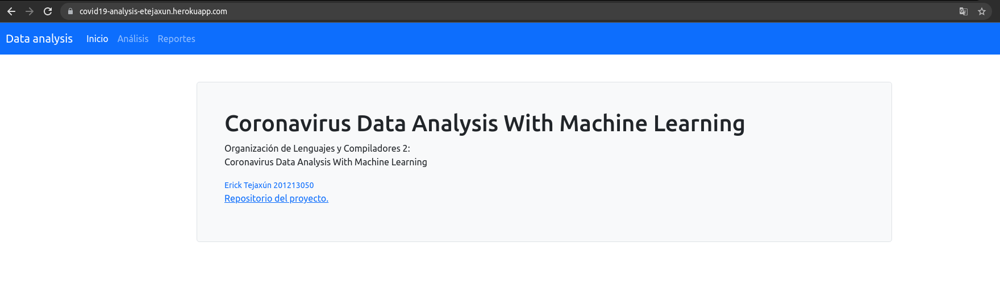
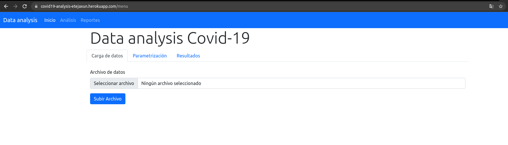
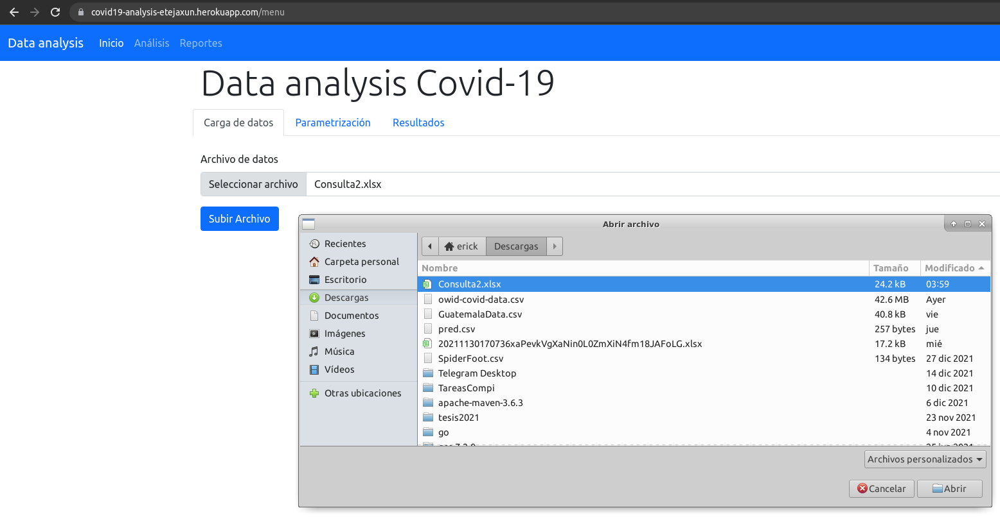
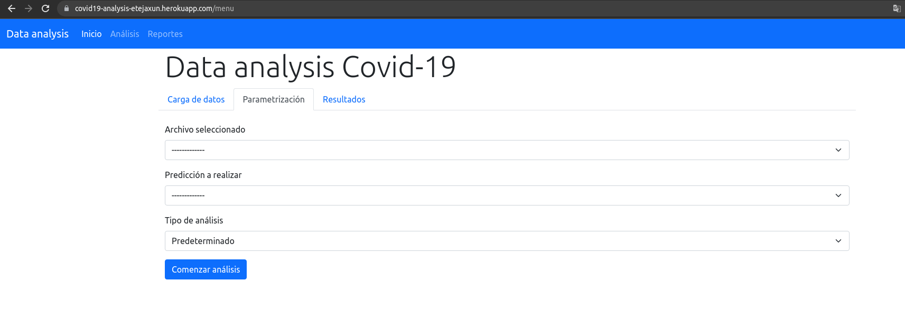
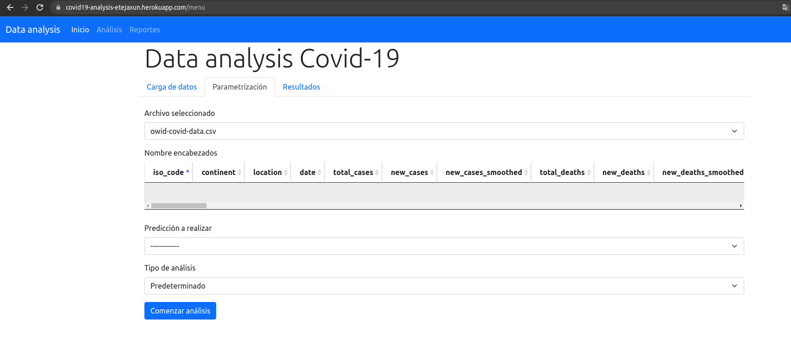
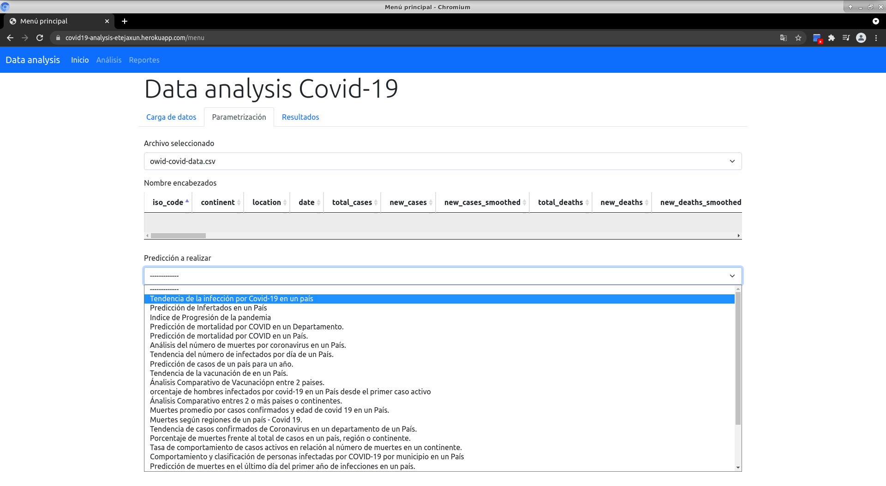
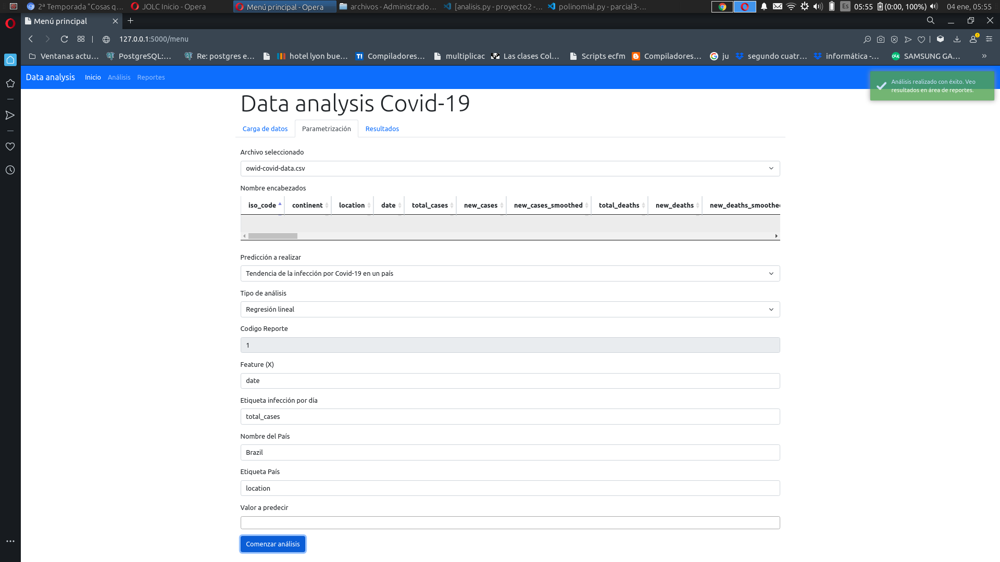
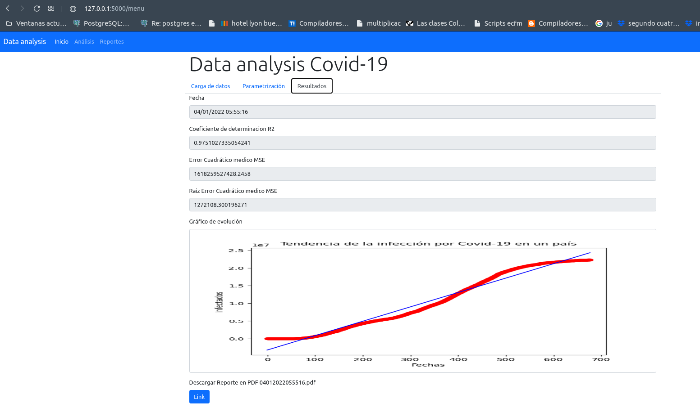
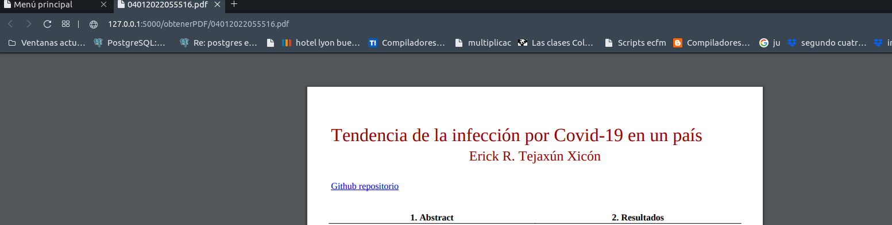

# Data analysis Covid-19
## Organización de lenguajes y compiladores 2
## Manual de usuario. 

El siguiente manual tiene como objetivo inducir al usuario al uso de esta aplicación web. 

## Aplicación
La aplicación web Data Analysis Covid 19 es una aplicación que permite obtener análisis de datos históricos sobre el COVID 19 . 

A continuación vemos la pantalla principal:

En el cuál tenemos las siguientes opciones de menú:
- Inicio : Vemos la pantalla de inicio.
- Análisis: Menú prinpical de la aplicación
- Reportes: Menú de reportes. 

## Menú prinicipal 
El menú principal es donde el usuario puede realizar todas los análisis sobre datos. 

### Opciones
- Carga de datos : Este menú permite cargar archivos nuevos al sistema. Si el archivo con el nombre existe, se actualizará. 
- Parametrización : Este menú permite elegir todos los parámetros para el anális. 
- Resultados : Área de reporte de resultados. 

### Carga de datos 
Este apartados permite al usuario cargar archivos para su análisis. 

- 1. Presionar el botón seleccionar archivo. 
- 2. Seleccione el archivo que desee cargar al sistema. 
- 3. Presionar el botón 'Subir Archivo'

### Parametrización
Este área permite configurar el nuevo análisis a lanzar. 

- 1. Debe seleccionar un archivo a analizar. Esto traerá una vista previa de las columnas del archivo seleccionado.

- 2. Debe seleccionar el análisis que desea realizar. Esto automáticamente cargará los parámetros necesarios para realizar el análisis. 

- 3. Establezca los parámetros para el análisis que desee realizar y luego presionar el botón 'Comenzar análisis'.

- 4. Luego del análisis, obtendremos los resultados en el apartado de Resultados. 

- 5. Para descargar el reporte en formato PDF presionar el botón que se encuentra debajo de la gráfica del informe. 

- [Enlace aplicación live](https://covid19-analysis-etejaxun.herokuapp.com/)
- [Repositorio](https://github.com/ErickTejaxun/covid-analysis)

## Autor
- Erick Tejaxun
- 201213050
- erickteja@gmail.com
